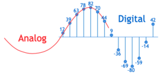
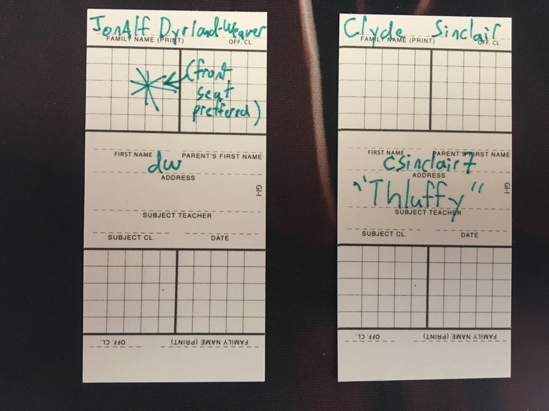

name: main

### .aim[: Welcome!]

---
template: main

## COURSE TITLE
### Teacher: Mr. Dyrland-Weaver (Mr. DW)
#### Useful information:
- Class website: www.stuycs.org/nextcs-dw
- Email address: dw@stuy.edu
- Office: 301
  - Free periods: 6, 7, 8
  - Making an appointment ahead of time is encouraged.

#### Required Materials
- Brain.
- Notebook.
  - Yes, a real physical notebook for writing in.
- Pen/Pencils.
- Access to a computer outside of class.
  - In class we will all use the provided computers.

---
template: main

#### Class Procedures

.center[]

| | |
|---|---|
|  |  |
| Analog Feedback Device | Digital Feedback Device |

---
template: main

### Delaney Cards!
.center[]

---
template: main

### More Class Procedures!
#### Table Buddies™
- You (probably) share a table with another student. You are each other's Table Buddy™.

#### Table Buddies+™
- If a TableBuddy™ pair turns away from their computer, they will see another pair of TableBuddies™!
- This group of 4 is a TableBuddy+™ group!
- There are edge cases with different TableBuddy+™ groupings.

--

#### Task:
In your Table Buddy+™ groups:
1. Introduce yourselves.
2. Ponder & discuss the following question:
   - What is the most important _skill_ you learn in school?
3. Select a representative from your group to report back to the class on your findings.
4. Reporter should make a note of their findings in their notebook
