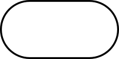

name: main

.aim[

fcs:

]

---
template: main

### Do Now:

Each TableBuddy™ pair has a paper with a diagram. Together, look over your diagram, answer the following:
- Do you understand what the diagram is?
- Can you explain your diagram to someone else?
- What parts of the diagram are clear?
- What parts of the diagram are confusing?

--

Share your diagram with your TableBuddy+™ group. Have them look at it and answer any questions they might have.

---
template: main

### Flowchart

- A flowchart is a diagram that represents a _workflow_.
- Following a flowchart should allow someone to easily repeat the workflow.
- There are standard symbols to help with understanding flowcharts.

---
template: main

### Flowchart Symbols

Symbol | Name | Puprpose
-------|------| --------
  | Terminal  | Indicates the start or end  
 | Process  | Action to be performed
  | Decision   | Yes/No Question  
     | Flowline   | Shows the flow of data  

---
template: main

### Algorithms

--

- An _algorithm_ is a sequence of steps that when followed, should solve a problem.

--
- Algorithms should contain specific instructions.

--
- An algorithm should produce the same results given the same inputs (some algorithms may have random elements).

--
- A flowchart is a graphical representation of a diagram.
