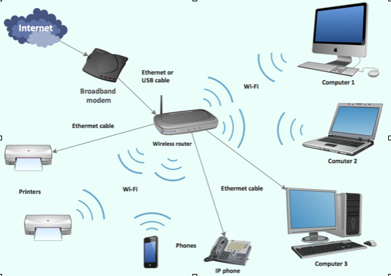
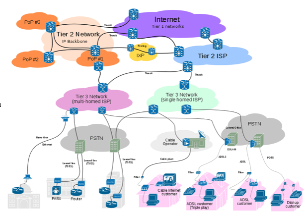

name: main

.aim[

fcs: We're All Connected

]

---
template: main

### Storage & Memory
- All saved data exists in storage.
- Anything that a computer is actively using is in memory.

--
- In order for a computer to use a stored file of any type, the file must be copied from storage into memory (loading).

--
- Saving a file means taking the version currently in memory and writing it back to storage.

--
  >> “Why do we tell you to turn it off and on again? Because we don’t have the slightest clue what’s wrong with it, and it’s really easy to induce coma in computers and have their built-in team of automatic doctors try to figure it out for us.”
-Peter Welch “Programming Sucks”

---
template: main

### Computer networks:
A computer network is a collection of computers that are connected to each to each other.

--
- A _network device_ facilitates the connection.

--
  - examples: ethernet switch, wireless access point, edge router…

--
- In a local network, all the computers are connected to the same network device.
.center[]

---
template: main

### Common network connection types.

--
- Radio Waves (RF)

--
  - WiFi, bluetooth, satellite, cellular networks.

--
- Electricity (almost always via copper wires)

--
  - Ethernet, Cable, DSL, Telephone lines

--
- Light

--
  - Fiber optic cables

---
template: main

### The Internet

--
- The internet is a group of [**Inter**connected **net**works](https://www.vox.com/a/internet-maps).
- The connection of top tier internet service providers creates the _backbone_ of the internet.
- Almost all of these connections use fiber optic cables.

.center[]

???

* Internet maps: https://www.vox.com/a/internet-maps
* Submarine cable map: https://www.submarinecablemap.com/

---
template: main
### Internet Addresses
Every device connected to the internet has an I.P. (Internet Protocol) address.
- They might look like this: `149.89.150.100`  (IPv4)
- or this: `0:0:0:0:0:ffff:9559:9664` (IPv6)

--
- IP addresses are only needed when connected.
- For the most part, organizations own blocks of IP addresses, and give them to their users as needed.

---
### Domain Names
Domain names are “words” meant to easily identify organizations on the internet without having to know IP addresses.

--
- .com, .edu, .gov, .org are all examples of __top level domains__.

--
- google.com, stuy.edu, stuycs.org are examples of __second level domains__.

--
- mail.google.com, homer.stuy.edu, www.stuycs.org are further __subdomains__.

--
  - If you control a second level domain, you can make any subdomains you want.

--
- DNS (Domain Name System) is a service that translates between domain names and IP addresses.

--
  - Whenever you go to a website via domain name, the first thing that happens is your computer sends a request to translate that domain name into an IP address.

???
# Web pages:
- What is a web page?
  - A file on (most likely) another computer formatted to be viewed through a web browser.
  - When you visit a website, the file gets copied from storage into memory, it’s just that the storage is from a different computer.
- What is a web site?
  - A collection of 1 or more interconnected web pages.
