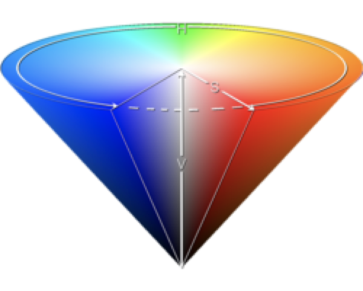

name: main

.aim[<div>
gfx: The Colors, Man.
</div>]

---
template: main

### Stuyvesant Computer Science Lab and Network Usage Policy

- Your account on our computer network, which is separate from the DOE provided network and accounts.
- The account provides both physical and virtual access to various resources.

#### Physical Access

- The StuyCS computer labs are located in rooms __307, 325, 352, 251__
- Your account will allow you to log into any computer in those rooms.
- These computers use a network file system (NFS), to store all home directories.
- No matter what StuyCS computer you use, you will have access to all of your files.
- The NFS server is located in the building, and upon login to a computer, your home directory files are temporarily loaded.

---
template: main
### Stuyvesant Computer Science Lab and Network Usage Policy

#### Virtual Access

- Your account will allow you remote access to our computers using the secure shell (SSH) protocol.
- Some of our classes cover creating websites, so we also provide web servers.
- When configured, our web servers will serve websites placed in a specific location within your home directory.
- You are responsible for keeping backups of any files you want to keep long term.
- In the event of any technical failure with our servers, your data may be lost.
- __Home directories may be erased at the end of the school year.__
- __Accounts will not be accessible over the summer, or after graduation (for seniors).__

---
template: main

### Your Responsibilities

#### Physical Labs

The computer labs and classrooms are shared spaces, and need to be treated respectfully so that everyone can take advantage of them. To that end:

- Keep all power, network, USB, and display cables plugged in where you found them. (Be mindful of your feet, in some rooms there are cables below the desks).
- Keep any food sealed and in your bag while in the room.
- Keep all liquids in sealed containers (a plastic cup with a snap on lid does not count), anything other than water must stay in your bag while in the room.
- Do not physically damage any computers, peripherals, desks, chairs or other equipment in the room.

---
template: main

### Your Responsibilities

#### Home Directory and Network Usage

In order to allow any student to access their files on any computer, and to support our SSH and web serving capabilities, our main file server must store the data for all users.

- Your accounts are for Computer Science work only, not for storing personal files or work for other classes.
- Do not download programs or multimedia files (unless directed by your teacher).
- Close all programs and log out (not just screen lock) at the end of class/dojo.


---
template: main

### Display Hardware

Comptuers Graphics is all about selecting the right pixels. The way we represent pixels and colors in software is infomred by the way display hardware generates those colors.

.center[<iframe width="711" height="400" src="https://www.youtube.com/embed/3BJU2drrtCM?si=1I6d57vmoWeZlZQE&amp;start=64" title="YouTube video player" frameborder="0" allow="accelerometer; autoplay; clipboard-write; encrypted-media; gyroscope; picture-in-picture; web-share" allowfullscreen></iframe>]


---
template: main

### Depth and Space

Image files contain color information. There are 2 important features of any image file.

__Color Depth__ is the amount of data used to represent a single color.

--

Examples:
| depth | # colors    | possible colors |
|   ---|---          |--- |
| 1 bit | 2           | black/white (or  black/green...)|
| 2 bit | 4           | black/white with some brightness conrol |
| 3 bit | 8           | Red Green Blue combinations (1 bit per color) |
| 3 byte| 16 million  |  RGB combinations (1 byte per color) |

---
template: main

### Depth and Space

__Color Space__ is the possible colors available, and how those colors are represented.

--

RGB is the most popular color space.

--

RGBA is RGB + Transparency (called alpha)

--

HSB is Hue, Saturation, Brightness/Value
.center[]


---
template: main

### Image File Formats
  - Vector

--
    - Vector formats represent images as a series of drawing instructions.
    - Infinitely scalable.
    - Common file type: SVG (Scalable Vector Graphics).

---
template: main

### Image File Formats
  - Raster
    - Raster formats represent images as a grid of color values (pixels).
--
    - Uncompressed formats contain data for each pixel.
--
      - Common file types: BMP, TIFF, RAW
--
    - Compressed formats use a compression algorithm to minimize file size.
--
      - Lossless vs. Lossy
--
        - Lossless compression algorithms contain enough information to exactly recreate the original image.
--
          - Common file types: PNG (Portable Network Graphics), GIF (Graphics Interchange Format)
        - Lossy compression algorithms do not retain all the details of the original image.
--
          - Common file type: JPEG (Joint Photographic Experts Group)

---
template: main

### Image File Formats
In this class, our graphics engines will be making image files.

File Type for this class: PPM (Portable PixMap)

--
  - Uncompressed raster format.
  - Pixel data is represented by RGB triplets in either ASCII or binary.
  - All whitespace is equivalent.

--
  - example file:
    ```
    P3
    4 3
    255
    255 0 0  255 0 0  255 0 0  255 0 0
    0 255 0  0 255 0  0 255 0  0 255 0
    0 0 255  0 0 255  0 0 255  0 0 255
    ```
--
  - File Header
    - `P3`: Type of PPM, 3-btye RGB, in ASCII (`P6` is RGB in binary)
    - `4 3`: Width x Height, in pixels
    - `255`: Maximum value per color (will scale to 255 if not 255)
