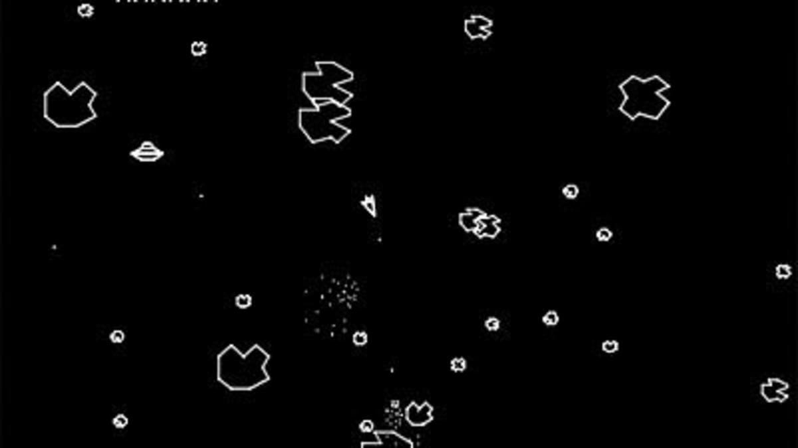

name: main

.aim[<div>
gfx: File this Under Formatting.
</div>]
<style>
table, td, th {
  border-collapse: collapse;
  border: solid 1px;
}
td {
  padding: 5px;
}
</style>


---
template: main

### Image File Formats

| | |
|---|---|
|  |  |

--
- Vector
  - Vector formats represent images as a series of drawing instructions.
  - Infinitely scalable.

--
  - Common file type: SVG (Scalable Vector Graphics).

---
template: main

### Image File Formats
  - Raster
    - Raster formats represent images as a grid of color values (pixels).
--
    - Uncompressed formats contain data for each pixel.
--
      - Common file types: BMP, TIFF, RAW
--
    - Compressed formats use a compression algorithm to minimize file size.
--
      - Lossless vs. Lossy
--
        - Lossless compression algorithms contain enough information to exactly recreate the original image.
--
          - Common file types: PNG (Portable Network Graphics), GIF (Graphics Interchange Format)
        - Lossy compression algorithms do not retain all the details of the original image.
--
          - Common file type: JPEG (Joint Photographic Experts Group)

---
template: main

### Image File Formats
In this class, our graphics engines will be making image files.

File Type for this class: PPM (Portable PixMap)

--
  - Uncompressed raster format.
  - Pixel data is represented by RGB triplets in either ASCII or binary.
  - All whitespace is equivalent.

--
  - example file:
    ```
    P3
    4 3
    255
    255 0 0  255 0 0  255 0 0  255 0 0
    0 255 0  0 255 0  0 255 0  0 255 0
    0 0 255  0 0 255  0 0 255  0 0 255
    ```
--
  - File Header
    - `P3`: Type of PPM, 3-btye RGB, in ASCII (`P6` is RGB in binary)
    - `4 3`: Width x Height, in pixels
    - `255`: Maximum value per color (will scale to 255 if not 255)
