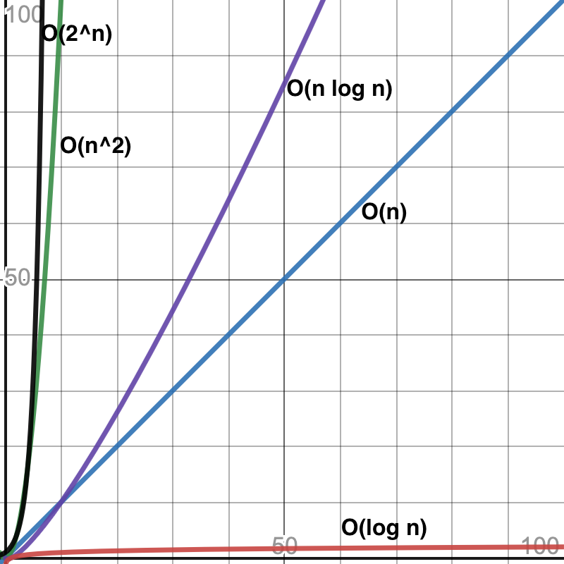

name: main

.aim[<div>
  fcs: Measuring Efficiency
  </div>]

---
template: main

### Project Euler problem 5:
> 2520 is the smallest number that can be divided by
each of the numbers from 1 to 10 without any remainder.
What is the smallest positive number that is evenly
divisible by all of the numbers from 1 to 20?


--
#### One possible solution
1. Guess that the answer is _n_

--
2. Check if guess is divisible by 2.

--
3. Keep checking each following integer for divisibility.

--
4. If at any point your guess is not divisible, update your guess by 1, go back to step 2.

--
5. If your guess is divisible up to _n_, then stop.

???
### The following function follows the above algorithm:
```
def euler5(n):
    guess = n
    max_divisor = 1
    while max_divisor <= n:
        if guess % max_divisor == 0:
            max_divisor+= 1
        else:
            guess+= 1
            max_divisor = 1
    return guess
answer = euler5(10)
print("euler5(10): ", answer)
```

---
template: main

#### How can we measure how effective this algorithm is?
The _efficiency_ of a algorithm is a measure of how much computing resources are needed to solve a problem. Most often, we are either referring to space (i.e. bytes), or time as the computing resources.

--
#### How can we measure time?

1. Hours/minutes/seconds
   - `time.time()`

--
2. Number of loop iterations.

---
template: main

#### [BigO  Complexity Graph](https://www.desmos.com/calculator/qhh3ch612h)

.center[

]

---
template: main

### P vs NP?
- Algorithms in O(n<sup>2</sup>) category are called polynomial time, they (or better classes) are generally considered "efficient".
- Algorithms in categories worse than polynomial time are considered _harder_ than others.

--
- __P__ is a category of problems that can be _solved_ in polynomial time.

--
- __NP__ is a category of problems that can be _verified_ (checked for correctness) in polynomial time.

--
  - Generally, NP problems are thought to be harder to solve than to verify.

--
- It is currently unproven, but widely believed that P &ne; NP.


???
  - Check a sudoku solution vs generate one
  - Prime factor a big number vs checking if factors are correct

- NP Complete is a category of NP problems
  - If a Polynomial time solution exists for one NP complete problem, it could be adapted to solve ANY NP complete problem.
- NP Hard is a category of problems _at least_ as hard as NP Problems
  - They cannot be verified in Polynomial time.
