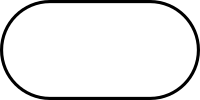

name: main

.aim[

fcs: Let the Code Flow Through You

]

---
template: main

### Do Now:

Each TableBuddy™ pair has a paper with a diagram. Together, look over your diagram, answer the following:
- Do you understand what the diagram is?
- Can you explain your diagram to someone else?
- What parts of the diagram are clear?
- What parts of the diagram are confusing?

After doing this, swap diagrams with your TableBuddies+™ partners and repeat.

---
template: main

### Flowchart

- A flowchart is a diagram that represents a _workflow_.
- Following a flowchart should allow someone to easily repeat the workflow.
- There are standard symbols to help with understanding flowcharts.

---
template: main

### Flowchart Symbols

.center[
Symbol | Name | Puprpose
-------|------| --------
  | Terminal  | Indicates the start or end  
 | Process  | Action to be performed
  | Decision   | Yes/No Question  
     | Flowline   | Shows the flow of data  
]
---
template: main

### Algorithms

--

- An _algorithm_ is a sequence of steps that when followed, should solve a problem.

--
- Algorithms should contain specific instructions.

--
- An algorithm should produce the same results given the same inputs (some algorithms may have random elements).

--
- A flowchart is a graphical representation of an algorithm.

---
template: main

### Racket Function Flowcharts

- Racket functions take in values, produce a result and return that result.

--
- One way to think about a flowchart for a racket program is that you are showing the path the input(s) take in order to reach the result.

--
- Each node on the chart represents a single function call.

--
- Each arrow represents the result of the outgoing node flowing into the input of the next node.

---
template: main

### Evaluating Racket Function Flowcharts

- A flowchart will use variables to represent values, but it is useful to test your flowchart with real numbers

---
template: main

.left-column[
#### Flow Chart

flowchart TD;
  id([getTensDigit]) -- n --> id0[quotient\nn 10];
  id0 -- result0 --> id1[remainder\nresult0 10];
  id1 -- result1 --> id2([END])

]

--
.right-column[
#### Flow Chart with Example

flowchart TD;
  id([getTensDigit]) -- 948 --> id0[quotient\n948 10];
  id0 -- 94 --> id1[remainder\n94 10];
  id1 -- 4 --> id2([END])

]
