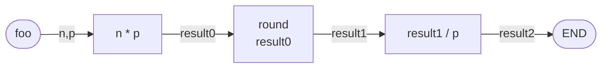

name: main

.aim[<div>
fcs: What If...?
</div>]

---
template: main

### Do Now
Use the flowchart below and the values `n = 48.5794` `p = 10` to make a test case flowchart.



The function `round(x)` will return `x` rounded to the nearest integer.

???
Turn chart into code.

---
template: main

### Conditional functions

Conditional functions return different values based on a boolean test

--

`if`
  ```
  (if test
    option0
    option1)
  ```

--

- Returns `option0` when `test` is `true`
- Returns `option1` when `test` is `false`

---
template: main

### Conditional functions

<div class="mermaid" width="500px">
flowchart LR;
  id0([area]) -- shape,size --> id1[remainder shape 2];
  id1 -- result0 --> id2[result0 = 0];
  id2 -- result1 --> id3{if result1};
  id3 -- true --> id4[squareArea size];
  id3 -- false --> id5[circleArea size];
  id4 -- result2 --> id6([END]);
  id5 -- result3 --> id7([END]);
</div>

---
template: main

### Conditional functions

<div class="mermaid" width="500px">
flowchart LR;
  id0([area]) -- shape,size --> id1[remainder shape 2];
  id1 -- result1 --> id3{if\nresult0 = 0};
  id3 -- true --> id4[squareArea size];
  id3 -- false --> id5[circleArea size];
  id4 -- result2 --> id6([END]);
  id5 -- result3 --> id7([END]);
</div>
