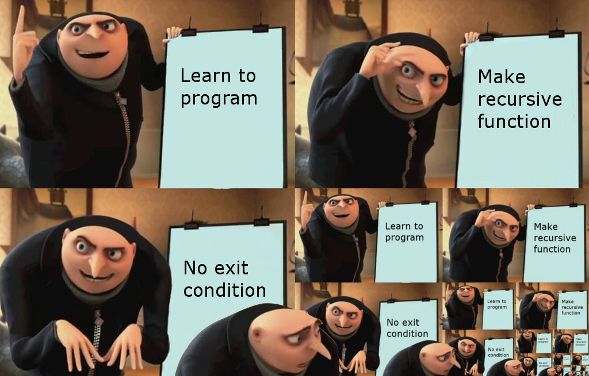

name: main

.aim[

fcs: To Curse Again

]

---
template: main

.center[]

---
template: main

### Linked List

One way to define a linked list is that a linked list is either:
- The empty list.
- A node with data and a link to a linked list.

--

This definition uses the term _linked list_ in its own definition. This is an example of a _recursive_ definition.

--

In the broadest sense, recursion is any process that involves self-reference.

--

In computer science, _recursive solutions_ solve problems by solving a simpler version.

---
template: main

### Recursion and Linked Lists

At any point in a linked list, there are only 2 things you can work with:
- The value
- The rest of the list

--

Recursive solutions to list problems break the problems into two cases:

--
- Recursive case
  - This is a smaller/easier version of the larger problem.
  - The recursive case usually involves performing an operation on the first value of the list, and then recursively using the same solution on the rest of the list.

--
- Base case
  - This is the absolute smallest/easiest version of the problem.

--
  - This is often when we have the empty list.

--
  - In Racket `(null? g)` will return `#t` if `g` is the empty list.

--

It is possible for there to be multiple recursive and base cases.
