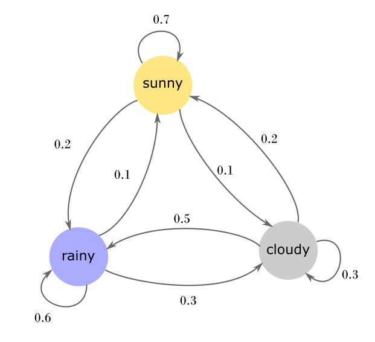

name: main

.aim[<div>
  fcs: Making Predictions
  </div>]

---
template: main

### Reminder: Test Friday 5/9


---
template: main

.center[

]


---
template: main

#### Markov Chains
- State transition model based on probabilities.

--
- You can always predict the next step by looking at the current step and possible results.

???

- show to be model picture
- compare to be model picture with dictionary
  ```
  {'be or': ['not'],
  'be that': ['is'],
  'not to': ['be'],
  'or not': ['to'],
  'that is': ['the'],
  'to be': ['or', 'that']}
  ```
  - probabilities are based on the lengths of the list.
- Creating a markov model of english means using real text to generate the probabilities of what words come after others.
- We're creating a probabilistic model of english, instead of attempting to model & create the
