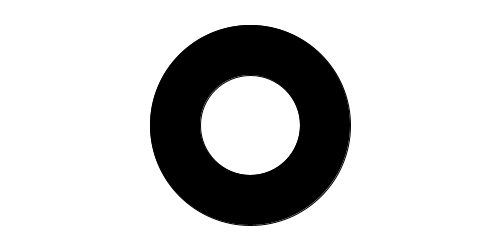

name: main

.aim[<div>
fcs: We Want the Func!
</div>]

---
template: main

### Do Now (do not log into computers):
You need to find the area of the shaded area of this shape:

.center[]

In your notebooks, answer these questions:
- What information do you need?
- How can you find the area?

---
template: main

### Making Custom Functions

If you want to write your own function, what do you need to know?

--
- What does the function do?

--
- What inputs does the function need?
    - When making a function, we call the inputs _parameters_.
    - When using a function, we call the inputs _arguments_.
--
- How does the function get to its return value given those inputs?

--

`lambda` is a function that creates and returns a new _function_.

--
- `lambda` takes 2 _arguments_
    - A list of parameters.
    - The function body

???
do lambda for circle area. show:
```
    > sqrt
    #<procedure:sqrt>
    > pi
    3.141592653589793
    > (lambda (x) (* x x))
    #<procedure>
```

how do we reuse this thing?

define!
