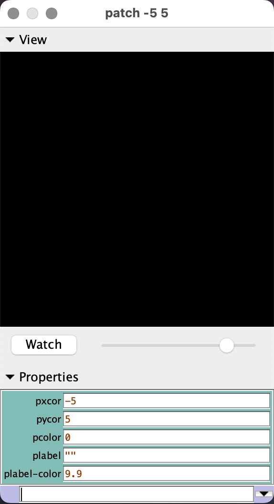
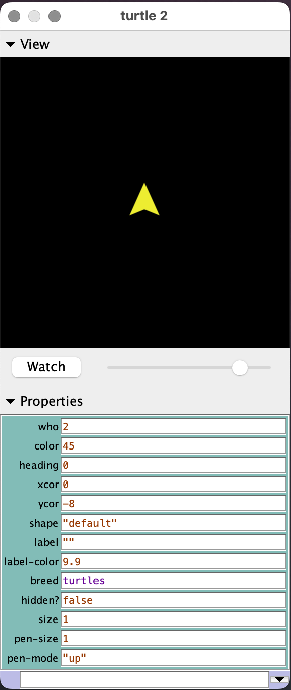

name: main

.aim[

fcs: Properties

]

---
template: main

### Properties
- The values that determine how agents appear and how we can identify them are called _properties_.
- Some properites are _immutible_ meanign they can't be changed.
- Prperties that are not immutible can be changes using `set`:
  - `set PROPERTY VALUE`

---
template: main

.left-column[
#### Patch Properties

]

---
template: main

#### Turtle Properties

