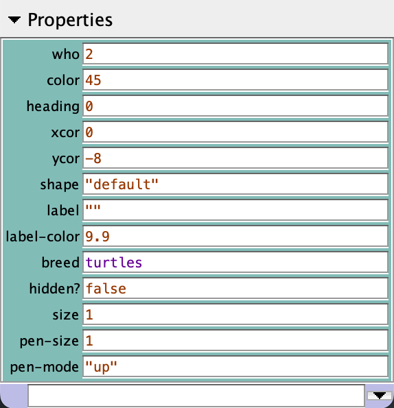

name: main

.aim[

fcs: Properties

]

---
template: main

### Properties
- The values that determine how agents appear and how we can identify them are called _properties_.
- Some properties are _immutable_ meaning they can't be changed.
- Properties that are not immutable can be changes using `set`:
  - `set PROPERTY VALUE`

---
template: main

.left-column[
#### Patch Properties

]

.right-column [
#### Turtle Properties

]
