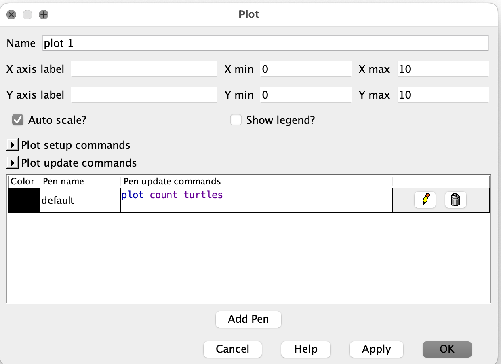

name: main

.aim[

fcs: Plot Devices

]

---
template: main

#### Plots
- A _plot_ is a NetLogo interface element that resembles a line graph, allowing you to follow changing values over time.
- Plots are made of __pens__. A pen is what draws a line on a plot. Each pen has two parts:
  - A color
  - A reporter that will run each time the pen updates.
- All pens will update with the number of ticks increase. You have to manually set this by using the `tick` command.
  - When you want to restart the plot, use `reset-ticks`, which will set ticks back to 0.

--
- When a plot updates, each pen will add a new (x, y) point to the line graph. The y-value will be the result of the pen's reporter. The x-value will be the current number of elapsed ticks.

---
template: main

#### Creating Plots
.left-column[

]
.right-column[

]
