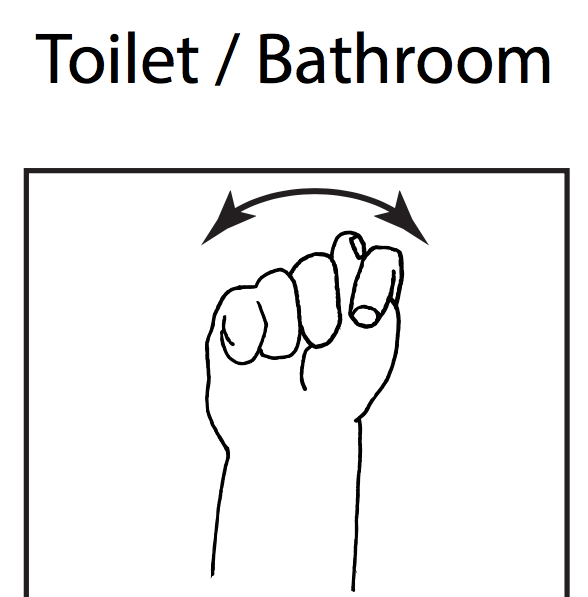

name: main
.aim[

  gfx: Welcome!
  
]

---
template: main

### Computer Graphics - MKS66C
### Teacher: Mr. Dyrland-Weaver (Mr. DW)

.cols[
.fifty[
#### Useful information:
- Class website: www.stuycs.org/graphics-dw
- Email address: dw@stuy.edu
- Office: 301
  - Free periods: 6, 7, 8
  - Making an appointment ahead of time is encouraged.
]

.fifty[
#### Required Materials
- Brain.
- Notebook.
  - Yes, a real physical notebook for writing in.
- Pen/Pencils.
- Access to a computer outside of class.
- GitHub Account
]]

---
template: main

#### Class Routines

--
.center[]

--

.cols[
.fifty[
 

Analog Feedback Device
]
.fifty[
 

Digital Feedback Device
]
]

---
template: main

### Delaney Cards!
.center[  ]

---
template: main

### More Routines!

- If the door is open, you may enter the room (as long as the previous class period has ended).
- When you come in, take out your notebook, do not log into your computer unless you are told to do so.
- In addition to binary feedback devices, your hands are the best way to let me know you have something important to say, please use them liberally.
- If you need to use the restroom (or leave the room for a moment), use the following ASL sign:

.center[]

---
template: main

### More Class Procedures!
#### Table Buddies™
- You (probably) share a table with another student. You are each other's Table Buddy™.

#### Table Buddies+™
- If a TableBuddy™ pair turns away from their computer, they will see another pair of TableBuddies™!
- This group of 4 is a TableBuddy+™ group!
- There are edge cases with different TableBuddy+™ groupings.

--
