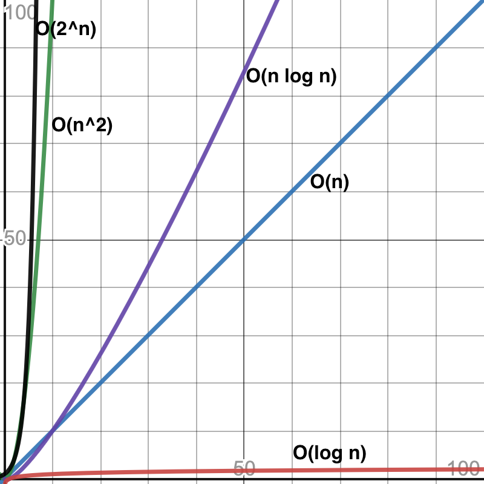

name: main

.aim[

nextcs:Defining Impossible

]

---
template: main

### Measuring Efficiency
When analyzing an algorithm, there are two main components that are considered:

--

- The amount of time it takes to run (time complexity).

--
- The amount of space/memory it takes to run (space complexity).

--

Sometimes these values are similar, sometimes they are inversely proportional (i.e. an algorithm sacrifices space complexity for time complexity).

---
template: main

### Big-O
When formally discussing the complexity of an algorithm, we often use __Big O__ notation. The purpose is to define how the time or space complexity changes as the amount of data (__n__) increases. Big O complexity is often organized in the following classes:

--
- _O(1)_ : constant. The algorithm's complexity is independent of the size of data.

--
- _O(log n)_ : logarithmic. The algorithm's complexity increases logarithmically as n increases.

--
- _O(n)_ : linear. The algorithm's complexity increases linearly as n increases.

--
- _O(n2)_ : quadratic/polynomial. The algorithm's complexity increases quadratically (or some polynomial degree constant) as n increases.

--
- _O(2n)_ : exponential. The algorithm's complexity increases exponentially as n increases.

---
template: main

#### [BigO  Complexity Graph](https://www.desmos.com/calculator/qhh3ch612h){:target="_blank"}

.center[

]

---
template: main

### P vs NP?
- Algorithms in O(n2) category are called polynomial time, they (or better classes) are generally considered "efficient".
- Algorithms in categories worse than polynomial time are considered _harder_ than others.

--
- __P__ is a category of problems that can be _solved_ in polynomial time.

--
- __NP__ is a category of problems that can be _verified_ (checked for correctness) in polynomial time.

--
  - Generally, NP problems are thought to be harder to solve than to verify.

--
- It is currently unproven, but widely believed that P &ne; NP.

???
  - Check a sudoku solution vs generate one
  - Prime factor a big number vs checking if factors are correct

- NP Complete is a category of NP problems
  - If a Polynomial time solution exists for one NP complete problem, it could be adapted to solve ANY NP complete problem.
- NP Hard is a category of problems _at least_ as hard as NP Problems
  - They cannot be verified in Polynomial time.

---
template: main

* Each group will be given a set of shuffled cards.

* The goal of each group is to produce a sorted set of cards (2-10,J,Q,K,A).

* At least one person in the group should write down the steps taken to create the sorted set of cards.

* Each group should end up with an algorithm based off of the steps they took to sort their cards.

* The goal is to have an algorithm that anyone could follow to create a sorted set of cards from a shuffled one.
